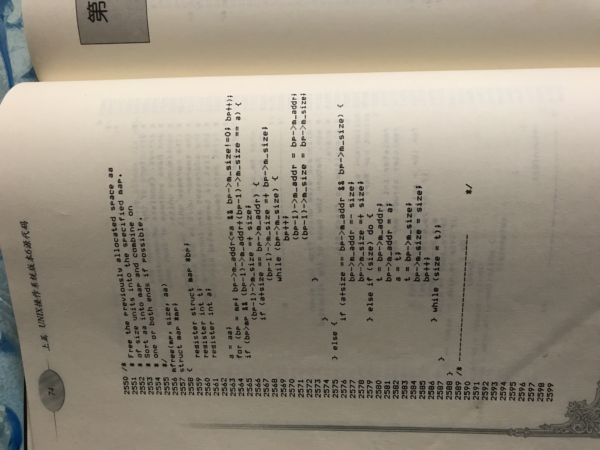

# 堆内存管理和火车售票算法

还记得12306刚刚上线时候的情景吗？系统处理能力极其有限，买票是一件费时费力的事情，网上一片哗然。有为12306辩护的，也有批评嘲讽的。为之辩护的理由大致是业务量太大，还有冲击性，慢情有可原；批评者认为就是技术能力差，业务量大的理由不成立。

一种观点认为，售票逻辑很特殊，本质上就复杂，这是12306系统性能不佳的主要原因。果真如此吗？本文就试图设计一种简单而高效的售票算法。

我实际上并不了解12306是如何实现的，因此即便了证明存在高效的售票算法，也不意味着采纳新算法就能提高12306的性能。可是，如果售票核心过程并没有拖累系统性能的话，业务逻辑相似但业务量远超12306的商城网站多得是，12306更没有理由那么慢，也就坐实了是技术能力低下。

要解释这个售票算法是如何工作的，不妨从堆内存管理算法说起。

一个稍微像样的程序，就免不了要和堆内存（heap）打交道。可是堆内存管理是怎么实现的呢？传统的有ptmalloc，高性能的有tcmalloc和jemalloc。不过这里不打算讨论他们，而是介绍它们的前辈，来自早期Unix实现的一个简单的实现，如下图。

||
|:----------:| 
|| 
|图一 | 
||
|图二|

图中的malloc从堆内存中取一块出来，返回给外部代码使用；外部代码将不再使用的堆内存返还到堆上，可供后继的malloc再次分配。

首先，要解释一下堆内存是怎么组织的。如图三。

||
|:----------:| 
|| 
|图三 | 

从malloc和free实现者的角度来说，堆内存就是一组内存块信息的列表。即上图中的Heap Info数组。其中，每一个内存块信息都记载着一段连续的内存的起始地址和大小，内存块不可以为空。注意，虽然内存信息是在数组中连续存放的，但是各内存块之间既不相邻，也不重叠。最后，这个列表中的内存块信息是按照对应内存块的地址，从低到高排好顺序。这些内存叫可用内存。

malloc的功能是在堆上分配要求大小的内存，这个堆在代码中记为mp。假设我现在要分配0x1000这么大一块内存，malloc就到mp中去查，看到第一块有0x10000字节，够大，那就从第一块中分配。很简单，把从地址0x10000开始的0x1000个字节分配出去即可。分配出去的内存就不算是可用内存了，因此要从堆信息中剔除。所以，第一块内存可用的部分就得把刚才分配的去除掉，于是第一块的记录信息就调整为0x11000:0x0f000, 如图四。

||
|:----------:| 
|| 
|图四 | 

如果下次要分配0x14000字节呢？第一块太小了，提供不了这么大的内存。第二块倒是可以。如果请求的更大呢？malloc就需要沿着Heap Info一直找下去，直到找到满足要求的，或者某块记录的内存地址为0，那就意味着找不到符合条件的. 这个查找过程就是代码中的for循环，这复杂度是关于空闲块数量线性的。

考虑一种情况，如果第二次请求了0x18000字节，第一块不够，但第二个块的大小恰好够，且分配后将导致第二个块没有剩余了。此时，需要将第二个块的信息从Heap Info中删除掉，就是代码中2538行开始的一段所处理的情况，将后面的信息都要往前挪。这个挪的过程也是线性复杂度的。分配后的堆内存信息如图五。

||
|:----------:| 
|| 
|图五 | 

下面看free的过程。

free的过程就是把传入的内存块加回到堆内存的空闲内存信息中去。上面提到，空闲内存信息列表是按照地址排序的，free操作完成后，必须还要维持这个列表是已序的。一个归还块和空闲块可能是相邻的，也可能不相邻。相邻又分为和前面的块相邻、和后面的块相邻。根据相邻情况的不同，归还操作可分为4种情形。

- 有前相邻块，没有后相邻块
- 有前相邻块和后相邻块
- 没有前相邻块，有后相邻块
- 没有前相邻块，也没有后相邻块

图二种的free代码就分别处理了这四种情况。

首先是2564行，定位到正确的归还位置。注意for的终止条件，如果你熟悉STL，一眼就能看出这相当于upper_bound算法，即定位到大于给定值的最小项。注意到图二种查找归还位置的过程是个线性复杂度的算法，没有利用上“空闲内存信息数据是已序的”这一信息。如果这里使用upper_bound算法，复杂度会就将为$O(\log_2N)$