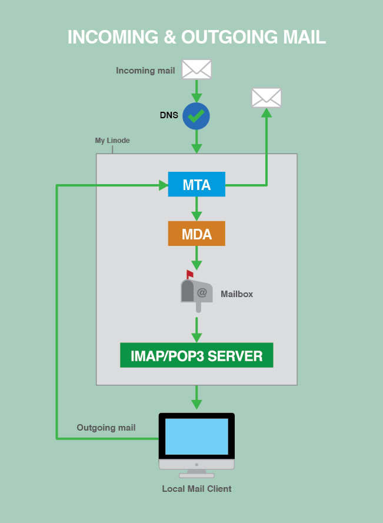

# 如何搭建自己的邮件服务器

你首先应该考虑选择第三方的邮件服务。在自己搭建之前，首先考虑如下的不利因素：

1. 配置很复杂
2. 服务器如果不工作（如下线）会导致丢邮件
3. 过滤垃圾邮件和病毒需要适当的调校
4. 可能被垃圾邮件发送者滥用
5. 没有技术支持

如果这些都不能阻止你，而你想要对邮件系统的完全控制，那么可以考虑自己搭建邮件服务器。

## 邮件服务器时如何工作的

需要先解释几个邮件服务器的黑话.

- **MTA:** _邮件传输代理（Mail Transfer Agent）_ 用来和外部的MTA传输邮件，
外部的MTA可以是其他邮件服务器或客户端. MTA会将收到的邮件暂时存储在一个队列中.
- **MDA:** _邮件投递代理（Mail Delivery Agent）_ 用将MTA的收件队列中的邮件转存到相应用户的邮箱.
- **IMAP/POP3服务器:** 管理用户以及用户邮箱，并提供IMAP/POP3连接供用户检阅邮件.

### 邮件处理过程

1. 到达邮件通过DNS查询到邮件服务器，然后直接投递到邮件服务器.
2. 当邮件经由MTA到MDA后,就会被存储在用户的邮箱中.
3. 当用户要取邮件时,用户的邮件客户端和IMAP/POP3服务器进行通信.

|图一 (取自Linode)|
|:----------:|
||

## 如何选择邮件服务器的组件

详细的信息可以参考<https://www.linode.com/docs/email/running-a-mail-server>.
有很多的选择,这里选择Postfix作为MTA,Dovecot同时作为MDA和IMAP/POP3服务.

## 构建邮件服务器

### SSL证书

尽管没有SSL的服务器是可能的,但是不推荐.现在Let's Encrypt可以申请通配符证书了,对个人用户来说方便很多,
别犹豫,赶紧申请.

### DNS记录

#### MX记录

首先要在DNS服务器上添加邮件服务器记录:
|Domain|TTL|Type|Priority|Target|
|:-------|:------|:------|:------|:------|
|mail.example.com|86400|**MX**|10|1.2.3.4|

#### SPF记录

SPF记录用于帮助反邮件欺骗. SPF记录说明了本域的外发邮件ip地址,接收邮件的服务器可以根据邮件头的域名查询是否
从SPF列举的ip发出的,如果不是,就拒绝.

`example.com 86400 TXT "v=spf1 a ~all"`

#### 反向DNS

如果是专用的邮件服务器,那么应该设置反向DNS,让ip指向邮件服务器域名.如果不是专用的或者控制不了,那就别设了,
代价是可能会被某些邮件服务器拒绝.

#### 软件安装

打算使用postgresql作为数据库,想使用mysql的,可以将下面包中的`pgsql`替换成`mysql`对应的包.

`sudo apt-get install postfix postfix-pgsql dovecot-core dovecot-imapd dovecot-pop3d dovecot-lmtpd dovecot-pgsql postgresql`

##### Postgresql

准备数据库

```sql
create database mailserver;
create user mailserver with encrypted password '<password>';
grant all on database mailserver to mailserver;
alter database  mailserver  owner to mailserver;

CREATE TABLE virtual_domains (
  id bigserial primary key,
  name text NOT NULL
);

CREATE TABLE virtual_users (
  id bigserial primary key,
  domain_id bigint NOT NULL references virtual_domains(id),
  password text NOT NULL,
  email text NOT NULL unique
) ;

CREATE TABLE virtual_aliases (
  id bigserial primary key,
  domain_id bigint NOT NULL references virtual_domains(id),
  source text NOT NULL,
  destination text NOT NULL
) ;
```

插入数据

```sql
INSERT INTO virtual_domains
  (id ,name)
VALUES
  ('1', 'example.com'),
  ('2', 'hostname.example.com'),
  ('3', 'hostname'),
  ('4', 'localhost.example.com');

INSERT INTO virtual_users
  (id, domain_id, password , email)
VALUES
  ('1', '1', crypt('password',gen_salt('md5')), 'email1@example.com'),
  ('2', '1', crypt('password',gen_salt('md5')), 'email2@example.com');

INSERT INTO virtual_aliases
  (id, domain_id, source, destination)
VALUES
  ('1', '1', 'alias@example.com', 'email1@example.com');
```

##### Postfix配置

/etc/postfix/main.cf:

```config.postfix
# See /usr/share/postfix/main.cf.dist for a commented, more complete version

# Debian specific:  Specifying a file name will cause the first
# line of that file to be used as the name.  The Debian default
# is /etc/mailname.
#myorigin = /etc/mailname

smtpd_banner = $myhostname ESMTP $mail_name (Ubuntu)
biff = no

# appending .domain is the MUA's job.
append_dot_mydomain = no

# Uncomment the next line to generate "delayed mail" warnings
#delay_warning_time = 4h

readme_directory = no

# TLS parameters
smtpd_tls_cert_file=/etc/letsencrypt/live/example.com/fullchain.pem
smtpd_tls_key_file=/etc/letsencrypt/live/example.com/privkey.pem
smtpd_use_tls=yes
smtpd_tls_auth_only = yes
smtp_tls_security_level = may
smtpd_tls_security_level = may
smtpd_sasl_security_options = noanonymous, noplaintext
smtpd_sasl_tls_security_options = noanonymous

# Authentication
smtpd_sasl_type = dovecot
smtpd_sasl_path = private/auth
smtpd_sasl_auth_enable = yes

# See /usr/share/doc/postfix/TLS_README.gz in the postfix-doc package for
# information on enabling SSL in the smtp client.

# Restrictions
smtpd_helo_restrictions =
        permit_mynetworks,
        permit_sasl_authenticated,
        reject_invalid_helo_hostname,
        reject_non_fqdn_helo_hostname
smtpd_recipient_restrictions =
        permit_mynetworks,
        permit_sasl_authenticated,
        reject_non_fqdn_recipient,
        reject_unknown_recipient_domain,
        reject_unlisted_recipient,
        reject_unauth_destination
smtpd_sender_restrictions =
        permit_mynetworks,
        permit_sasl_authenticated,
        reject_non_fqdn_sender,
        reject_unknown_sender_domain
smtpd_relay_restrictions =
        permit_mynetworks,
        permit_sasl_authenticated,
        defer_unauth_destination

# See /usr/share/doc/postfix/TLS_README.gz in the postfix-doc package for
# information on enabling SSL in the smtp client.

myhostname = example.com
alias_maps = hash:/etc/aliases
alias_database = hash:/etc/aliases
mydomain = example.com
myorigin = $mydomain
mydestination = localhost
relayhost =
mynetworks = 127.0.0.0/8 [::ffff:127.0.0.0]/104 [::1]/128 192.168.1.0/24  # 192.XXX: 允许本地网络发送邮件
mailbox_size_limit = 0
recipient_delimiter = +
inet_interfaces = all
inet_protocols = all
proxy_interfaces = email.example.com # 如果邮件在NAT后面,或者是备份邮件服务器,必须指定此项

# Handing off local delivery to Dovecot's LMTP, and telling it where to store mail
virtual_transport = lmtp:unix:private/dovecot-lmtp

# Virtual domains, users, and aliases
virtual_mailbox_domains = pgsql:/etc/postfix/pgsql-virtual-mailbox-domains.cf
virtual_mailbox_maps = pgsql:/etc/postfix/pgsql-virtual-mailbox-maps.cf
virtual_alias_maps = pgsql:/etc/postfix/pgsql-virtual-alias-maps.cf,
        pgsql:/etc/postfix/pgsql-virtual-email2email.cf

# Even more Restrictions and MTA params
disable_vrfy_command = yes
strict_rfc821_envelopes = yes
#smtpd_etrn_restrictions = reject
#smtpd_reject_unlisted_sender = yes
#smtpd_reject_unlisted_recipient = yes
smtpd_delay_reject = yes
smtpd_helo_required = yes
smtp_always_send_ehlo = yes
#smtpd_hard_error_limit = 1
smtpd_timeout = 30s
smtp_helo_timeout = 15s
smtp_rcpt_timeout = 15s
smtpd_recipient_limit = 40
minimal_backoff_time = 180s
maximal_backoff_time = 3h

# Reply Rejection Codes
invalid_hostname_reject_code = 550
non_fqdn_reject_code = 550
unknown_address_reject_code = 550
unknown_client_reject_code = 550
unknown_hostname_reject_code = 550
unverified_recipient_reject_code = 550
unverified_sender_reject_code = 550
```

/etc/postfix/pgsql-virtual-mailbox-domains.cf:

```config.postfix
user = mailuser
password = mailuserpass
hosts = 127.0.0.1
dbname = mailserver
query = SELECT 1 FROM virtual_domains WHERE name='%s'
```

/etc/postfix/pgsql-virtual-mailbox-maps.cf:

```config.postfix
user = mailuser
password = mailuserpass
hosts = 127.0.0.1
dbname = mailserver
query = SELECT 1 FROM virtual_users WHERE email='%s'
```

/etc/postfix/pgsql-virtual-alias-maps.cf:

```config.postfix
user = mailuser
password = mailuserpass
hosts = 127.0.0.1
dbname = mailserver
query = SELECT destination FROM virtual_aliases WHERE source='%s'
```

/etc/postfix/pgsql-virtual-email2email.cf:

```config.postfix
user = mailuser
password = mailuserpass
hosts = 127.0.0.1
dbname = mailserver
query = SELECT email FROM virtual_users WHERE email='%s'
```

/etc/postfix/master.cf:

把原来配置文件顶部的两段取消注释,其余的保持不变:

```config.postfix
#
# Postfix master process configuration file.  For details on the format
# of the file, see the master(5) manual page (command: "man 5 master" or
# on-line: http://www.postfix.org/master.5.html).
#
# Do not forget to execute "postfix reload" after editing this file.
#
# ==========================================================================
# service type  private unpriv  chroot  wakeup  maxproc command + args
#               (yes)   (yes)   (yes)    (never) (100)
# ==========================================================================
smtp      inet  n       -       n       -       -       smtpd
#smtp      inet  n       -       -       -       1       postscreen
#smtpd     pass  -       -       -       -       -       smtpd
#dnsblog   unix  -       -       -       -       0       dnsblog
#tlsproxy  unix  -       -       -       -       0       tlsproxy
submission inet n       -       y      -       -       smtpd
  -o syslog_name=postfix/submission
  -o smtpd_tls_security_level=encrypt
  -o smtpd_sasl_auth_enable=yes
  -o smtpd_sasl_type=dovecot
  -o smtpd_sasl_path=private/auth
  -o smtpd_reject_unlisted_recipient=no
  -o smtpd_client_restrictions=permit_sasl_authenticated,reject
  -o milter_macro_daemon_name=ORIGINATING
smtps     inet  n       -       -       -       -       smtpd
  -o syslog_name=postfix/smtps
  -o smtpd_tls_wrappermode=yes
  -o smtpd_sasl_auth_enable=yes
  -o smtpd_sasl_type=dovecot
  -o smtpd_sasl_path=private/auth
  -o smtpd_client_restrictions=permit_sasl_authenticated,reject
  -o milter_macro_daemon_name=ORIGINATING
  ...
```

##### Dovecot配置

需要修改下列文件:

```config.text
/etc/dovecot/dovecot.conf
/etc/dovecot/conf.d/10-mail.conf
/etc/dovecot/conf.d/10-auth.conf
/etc/dovecot/dovecot-sql.conf.ext
/etc/dovecot/conf.d/10-master.conf
/etc/dovecot/conf.d/10-ssl.conf
```

/etc/dovecot/dovecot.conf:

添加protocols.

```config.dovecot
## Dovecot configuration file
...
# Enable installed protocols
!include_try /usr/share/dovecot/protocols.d/*.protocol
protocols = imap pop3 lmtp
...
postmaster_address=postmaster at example.com
```

/etc/dovecot/conf.d/10-mail.conf:

修改mail_location如下.

```config.dovecot
...
mail_location = maildir:/var/mail/vhosts/%d/%n/
...
mail_privileged_group = mail
...
```

执行下列命令:

```bash
mkdir -p /var/mail/vhosts/example.com
groupadd -g 5000 vmail
useradd -g vmail -u 5000 vmail -d /var/mail
chown -R vmail:vmail /var/mail
```

/etc/dovecot/conf.d/10-auth.conf

```config.dovecot
...
disable_plaintext_auth = yes
...
auth_mechanisms = plain login
...
!include auth-system.conf.ext
...
!include auth-sql.conf.ext
...
```

```config.dovecot
```

```config.dovecot
```

```config.dovecot
```