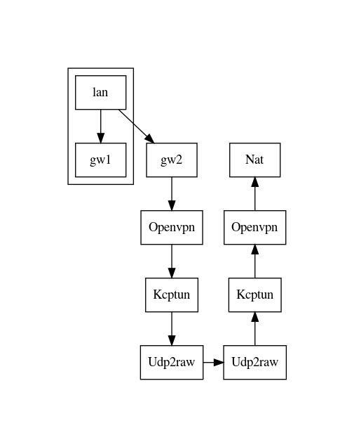

# 架梯笔记

## 前言

这篇文章的内容本来是备查性质，放Wiki就好了，发Blog是在浪费读者和自己的时间。 之所以还要发出来，是想留做一个历史的见证，见证像我这样的人，浪费了多少金钱、时间、精力乃至生命在这种本不必做的事情上。

半年前配的机器，因为有梯子可以蹭，虽然不够快，也不够方便，但因为有的用，就一直拖着没把自己的梯子弄好。从我的身上，大概可以照出国人的惰性、忍耐和得过且过吧。本来可以就这么一直忍耐下去的，直到某天我到了公司，发现不能拨OpenVPN到家里了，因为公司的IT禁掉了OpenVPN的协议。这是完全合理的。只是我却要不能蹭公司的梯子了，虽然很容易就绕过IT的限制，但危机意识也被唤醒了：我不可能一直蹭下去的。必须要完工自己的梯子了。从查资料，到最终完工，正好一周。工作日每天搞1~2个小时，周末两天合计8小时差不多是有的。我默默地乘了一下我的时薪，记下一笔帐在心里。

## 方案

网络拓扑:


说明:

gw2这一列是在本地,客户端.Nat一列是远程服务器端.因为要用Kcptun,Openvpn只能走TCP.Kcp是TCP接入,UDP输出.Udp2raw是UDP接入,Fake TCP输出.服务端的顺序全部反过来,最后从服务端Nat上网. 整个路线相当绕,副作用是流量特征更不明显了.

各部分分工:

- openvpn: 建立虚拟子网,这样就不必总是要走代理了.
- Kcptun: 传输加速,付出额外流量为代价, 外加一点点流量混淆. 流量混淆的能力应该不强,毕竟主要不是干这个的. 我家的电信宽带访问境外网站总是丢包率很高,几年前和电信折腾过一把,也没什么改善. 所以这次打算用kcp暴力硬干了.
- Udp2raw: 把输入的UDP包包装成假的TCP包.说是假的,其实中途路由器看到的是合法的TCP数据包,但是这些TCP数据报并不是由OS创建的,而是由Raw socket直接构造TCP数据报.为了骗过Nat和路由,还要模拟三次握手;为了防止内核发RST,还要通过iptables drop掉这假TCP数据报.也是够折腾的. 之所以不直接kcptun到kcptun,一来现在的kcptun开始能比较快地被墙只能识别的(在我家观察到的就是一小段时间内和对端的所有通信都断掉,持续几分钟到十几分钟), 虽然识别效果还不是特别好. kcptun直接走udp,有些ISP会降低UDP数据报的优先级,并且在流量大时或高峰时段限流,体验比较差.本来是想用rsock的,因为rsock会用多条tcp连接传输数据,隐蔽性更好,udp2raw只有一条TCP流.但是我发现用rsock时内核报了很多数据包错误,丢弃了很多包.怀疑是我的iptables没配对,但是rsock文档用的又不是iptables,懒得去花时间再看一遍手册了. 事后看udp2raw效果够好了,就不折腾了.啥时候墙升级导致udp2raw不好用了再说.

## 软件准备

下载 [kcptun](https://github.com/xtaci/kcptun/releases/download/v20190924/kcptun-linux-amd64-20190924.tar.gz) [udp2raw](https://github.com/wangyu-/udp2raw-tunnel/releases/download/20181113.0/udp2raw_binaries.tar.gz)

rsock的下载[在此](https://github.com/iceonsun/rsock/releases/download/v2.0.1/rsock-Linux-x86_64-20180613.tar.gz)

## 配置

按照[kcptun文档](https://github.com/xtaci/kcptun/blob/master/README.md)的建议，首先需要增加文件句柄数限制，`ulimit -n 65535`, 这个可以放在`.bashrc`中.然后修改`sysctl.conf`.

```config
net.core.rmem_max=26214400 // BDP - bandwidth delay product
net.core.rmem_default=26214400
net.core.wmem_max=26214400
net.core.wmem_default=26214400
net.core.netdev_max_backlog=2048 // proportional to -rcvwnd
```

客户端,假设远程地址是`1.1.1.1`:

```bash
dp2raw_amd64 -c -l127.0.0.1:20002 -r1.1.1.1:20003 -k 'your password' --raw-mode faketcp -a --keep-rule

KCP Client: ./client_kcptun -r "127.0.0.1:20002" -l ":20001" -mode fast3 -nocomp -autoexpire 900 -sockbuf 16777217 -dscp 46
```

服务器端

```bash
udp2raw_amd64 -s -l0.0.0.0:20003 -r127.0.0.1:20002 -k 'your password' --raw-mode faketcp -a --keep-rule
KCP Server: ./server_kcptun -t "127.0.0.1:20001" -l ":20002" -mode fast3 -nocomp -sockbuf 16777217 -dscp 46
```

### CA 配置

新的EasyRSA版本是3.x了，和2.x不兼容。我也不想研究怎么升级上来了，新开一个CA吧。易用性方面似乎稍有改进。 步骤如下：

1. 创建CA根目录,并初始化

   ```bash
   make-cadir app-ca
   cd app-ca
   ./easyrsa init-pki
   ```

   如果要定制vars文件，可以在`init-pki`之前修改好。也就是预设一些`set_var`值。核心的内容都在`pki`目录下面，永远都不要手工去动里面的任何文件，细节相当之繁琐。重要的文件有：`ca.crt`，`dh.pem`，后面命令会生成这些文件。重要的目录有：`private`,私钥；`reqs`，签名请求；`issued`,签好名的证书。`renewed`和`revoked`也是顾名思义。

2. 初始化CA：

   ```bash
   ./easyrsa build-ca nopass
   ```

   `nopass`的作用是免设置密码，默认是要求设置密码。中途按照提示，填一下CN。随便写，默认是`Easy-RSA CA`.

3. 生成dh文件

   ```bash
   ./easyrsa gen-dh
   ```

   这一步可能很慢。

4. 生成服务器证书：

   ```bash
   ./easyrsa build-server-full openvpn-server nopass
   ```

   `openvpn-server`是随便起的证书名字。最好起个有含义的，好管理。

5. 生成客户端证书

   ```bash
   ./easyrsa build-client-full openvpn-client nopass
   ```

### openvpn配置

1. 生成ta.key

   ```bash
   openvpn --genkey --secret ta.key
   ```

2. 服务器端配置文件

   ```config
   dev tun
   persist-key
   persist-tun
   topology subnet
   port 20001
   proto tcp
   keepalive 10 120

   # Location of certificate authority's cert.
   ca /etc/openvpn/server/ca.crt

   # Location of VPN server's TLS cert.
   cert /etc/openvpn/server/server.crt

   # Location of server's TLS key
   key /etc/openvpn/server/server.key

   # Location of DH parameter file.
   dh /etc/openvpn/server/dh.pem

   # The VPN's address block starts here.
   server 10.89.0.0 255.255.255.0

   # Drop root privileges and switch to the `ovpn` user after startup.
   user ovpn

   # OpenVPN process is exclusive member of ovpn group.
   group ovpn

   push "redirect-gateway def1 bypass-dhcp"

   # Cryptography options. We force these onto clients by
   # setting them here and not in client.ovpn. See
   # `openvpn --show-tls`, `openvpn --show-ciphers` and
   #`openvpn --show-digests` for all supported options.
   tls-crypt /etc/openvpn/server/ta.key
   auth SHA512    # This needs to be in client.ovpn too though.
   tls-version-min 1.2
   tls-cipher TLS-DHE-RSA-WITH-AES-256-GCM-SHA384:TLS-DHE-RSA-WITH-AES-256-CBC-SHA256
   ncp-ciphers AES-256-GCM:AES-256-CBC

   # Logging options.
   ifconfig-pool-persist ipp.txt
   status openvpn-status.log
   log /var/log/openvpn.log
   verb 3
   ```

3. 客户端配置

   ```config
   client
   dev tun
   persist-key
   persist-tun
   proto udp
   nobind
   user ovpn
   group ovpn
   remote-cert-tls server
   auth SHA512
   verb 3

   remote 127.0.0.1 20001

   ca ca.crt
   cert client1.crt
   key client1.key
   tls-crypt ta.key
   ```

### 配置dnsmasq和路由

配好OpenVPN,如果要翻墙,客户端指定网关到gw2就可以了,DNS服务器指定成`8.8.8.8`就行. 但这样一来所有流量都翻墙走,访问国内的网站反而变慢,甚至不通. 因此最好是访问国内地址最好不要爬梯子. 因此,需要知道被墙网站的ip地址,然后将到达这些ip的路由改走gw2.
对于被墙的网站,很多域名是污染了的--这种DNS服务器真的很可耻--返回的是错误的ip地址. 还好,有人维护了一个被墙网址清单,其中有上万个域名--真够多的. 虽然更新不太及时,但总是个好些的起点. 其中这些应该去掉,否则上微信会变慢:

- licdn.com
- qpic.cn

还有这些我也去掉了:

- amazon.com
- doubleclick.net
- linkedin.com

dnsmasq 配置起来是很方便的,尤其是在Debian这样的系统上(其实只是我只对Debian比较熟悉啦).

有了这些域名并不能就拿到关联的IP地址,因为这些域名可以有子域名的.以前网上推荐的一个做法是列出所有国内的地址段,只要目标不是国内地址段就全部走VPN.实践证明,这是以牺牲上网速度为代价的,很多网站,包括某宝、某东都会卡.即使从apnic这样的地方下回来的官方列表,仍然和实际情况有差别,虽然差别不一定多大,但是影响却很大.例如查到一段地址归属地是印度,Whois却显示分配给某宝的,而且RTT极小,不太可能在国外. 这种地址要是走VPN, 体验立刻就变很差. 其实我只需要爬梯子到被墙的、我要访问到的那些地址就好. 另外, 完整的国内的地址段列表很长,数千条.这对路由性能其实不构成压力,但是我管起来就麻烦了,毕竟这东西不是一成不变的.

为了找出哪些地址是可能被墙的, 写了个程序监控并分析dnsmasq的查询日志.发现C++的字符串处理竟然是我的短板,我居然没有一个随手可用的C++字符串库工具箱.这个功课必须补上.一边写程序,一边调整分析过程,然后一边在其他设备上访问那些不存在的网站和应用.居然收集了几百个域名和数千个IP地址. 还好,程序再辅助到apnic的列表中去查分配记录,归类后还是有几百条找不到记录的.当时没想到apnic只是6个地址分配机构之一,应该还要合并其他机构的分配记录.于是对于找不到归属的,直接脚本调用whois抽取,然后再把相同地址段的合并.最后得到100多个地址段. 一百多条路由还是比较好维护的. 至此,算是比较好地实现了自动翻墙.这个和透明代理是不同的技术方案.

## 心得

方滨兴多年前的一篇综述论文,曾经高瞻远瞩地指明了墙的发展方向--虽然那个时候他还没能预言AI筑墙的能力, 也指明了梯子的发展方向. 很高兴看到现在的许多工具在正确的方向上快速发展. 但特征是无法真正消除的, 特征模拟可能是下一步要做的, 但是显然会更复杂, 代价也会更高. 多样化、小众化是另一个可能的选择.

## 后记

家里的一台Sony的电视机有Youtube应用,以前梯子搭好是可以直接看YouTube的. 这次搭好梯子居然看不了了,但似乎和梯子无关. Youtube Kids还是可以看的, 第二天上班前在家看了一小时儿童教育片.

另一件事是rclone下电影,有惊有喜.喜的是下载速度惊人, 平均在100Mb/s, 惊的是两天跑了1.2T, 按照这个速度不够我撑到月底的.

apt install -y command-not-found  iputils-ping  dnsutils traceroute procps openssh-server sudo  whois

用了rclone又暴露出来另一个问题,kcp的client不够稳定,每天自动退出一次.看来还得给kcp起一个监控.
